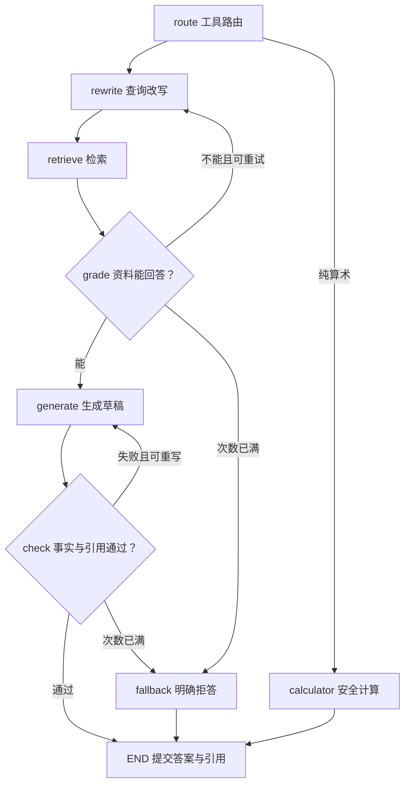

# 高级 RAG 项目：从文档到可信回答的完整过程

这份说明对应同目录工程的实际实现。先用免 Key 演示模式走通，再阅读代码和替换真实模型。已读取八张截图；补充的六张图片提供了清晰的章节、切分和检索参数。视频链接可从截图识别，但当前工具未取得视频或字幕，内部表设计与私有实现不作推断。

## 1. 先理解这个系统在解决什么

一段普通“检索 + 拼提示词”的程序只回答：找到了什么、怎么让模型生成。这个项目还要回答四类工程问题：文档怎样变成可更新的知识；查询怎样同时匹配语义和关键词；一次回答怎样判断证据是否足够；前端怎样展示过程且不保留失败草稿。

把输入分成两种：**文档输入改变知识库存量，问题输入读取已发布的知识**。离线入库写数据库；在线检索只读取 ready 文档。LangGraph 不另建一份检索逻辑，而是调用同一个 AdvancedRetrieverPipeline。

## 2. 双库分别负责什么

| 数据 | 实际存储 | 为什么 |
|---|---|---|
| 用户、知识库、策略、文档状态 | MySQL 的业务表 | 需要权限、约束和业务事务 |
| 父块全文与出处位置 | MySQL ParentChunk | 回溯完整证据，支持人工修正 |
| 子块文本、1024 维向量、父块 ID、元数据 | PG ChunkVector | 执行余弦向量检索 |
| 入库任务与租约 | MySQL IngestJob | 上传返回后任务仍存在，worker 可恢复 |
| 对话、最终消息、运行与步骤 | MySQL | 多轮指代消解、过程追踪、结果回放 |
| 提示词、工具开关、评测运行 | MySQL | 按用户保存配置和实际结果 |

没有跨数据库外键。子块的 parent_id、doc_id、kb_id、owner_id 都是逻辑关联键。客户端不能通过提交别人的 ID 获得权限：服务端先校验 KnowledgeBase.owner_id，再计算允许检索的文档集合；向量查询还会再次限定 owner_id 和 kb_id。

Tortoise 将 app.models 路由到 business，将 app.vector_models 路由到 vectors。PGVector 没有被伪装成普通 JSON 列：VectorField 在 PG 上生成 VECTOR(1024)，Demo SQLite 上采用 TEXT 适配。SQL 距离操作仍写在 VectorStore，因为 ORM 普通过滤语法不表达 `<=>` 排序。

## 3. 离线入库：一份文件怎样成为知识

以“差旅政策.md”为例：

1. JWT 鉴权成功，确认目标知识库属于当前用户。
2. 校验扩展名、大小；文件内容 SHA256 防止同库重复上传。
3. 保存文件。用同一业务事务创建 Document(status=queued) 和 IngestJob(status=queued)。上传接口返回任务 ID，不等待模型完成。
4. worker 原子领取任务，写 processing 与租约。处理时定期续租；进程退出留下的过期任务可由下一 worker 重新领取，最多尝试 3 次。
5. Parser 将文件统一成 ParsedUnit(content, metadata)。PDF 每页保留页号，Word 保留段落/表格顺序，Excel 每行保留工作表与行号。
6. 以父块长度限制拆分，再在父块内部切子块；子块保存父块内 start/end。
7. 子块调用 Embedding，检查维度、有限数值和非零向量。入库使用 document 类型。
8. PG 事务替换该文档的子块向量；MySQL 事务写父块、统计数量、发布 ready 并增加知识库 revision。

**为何最后才设置 ready？** 假如写到 PG 后 MySQL 故障，在线查询不会把这份尚未发布的文档加入允许文档集合。再次索引使用相同文档范围进行替换，完成后再发布。这个协议实现可恢复的发布流程，不是跨库原子事务。

删除也先把文档标记 deleting，使在线链路看不见它，再清除向量、父块、任务、文档记录和上传文件。BM25 的版本缓存因 revision 变化失效；检索完成前再确认一次文档仍为 ready。

## 4. 父子分块究竟有什么用

原文可能是：

> 公司差旅政策规定，员工出差后必须在7天内提交报销申请。报销需要发票和审批单。住宿报销上限为每晚500元。

若整篇文件只形成一个向量，查询“住宿报销上限”可能被整篇其他内容稀释。若每小句直接送生成，命中“每晚500元”又可能丢失适用范围。父子分块用小块定位，用大块解释。

父块可能包含上述整段。三个子块分别强调期限、所需材料、住宿上限；它们共享 parent_id。命中第三个子块后，最终证据取完整父块。

本实现以 **Python 字符数** 控制长度：默认 parent_size=1200、child_size=300、child_overlap=0，优先段落或句末切分。字符与 tokenizer tokens 不同，父块也不保证正好包含 2～4 个子块。真实文档很短时只有一个子块；很长段落按预算硬切。不要把示例数值说成固定结构。

单元测试检查原文覆盖、精确偏移、长段落前进、稳定 ID 和子块不越父块边界。

## 5. 在线检索：每一步具体改变什么

### 5.1 先把问题还原完整

第一轮：“公司差旅报销怎么申请？”下一轮：“它的时间限制呢？”指代消解利用已接受的对话历史，把后者改为独立可检索的问题。失败或被取消的生成不进入已接受历史。纯向量/混合预设为隔离检索差异关闭改写；需要多轮指代消解时，使用 full 预设，或在自定义策略中开启 query_rewrite，并将应用策略设为 custom。

多查询扩展保留原问题，再增加至多3个不同问法，合计最多4条（指代消解后的独立问句也计入这一预算）。HyDE 可以额外生成一段“假设该问题得到回答的文档”，仅将它嵌入向量空间辅助召回。**HyDE 不是真实资料，不进入父块上下文，也不能成为引用来源。**

### 5.2 两路召回有不同职责

向量路适合语义近似。PG 使用：

```sql
SELECT ..., 1 - (embedding <=> $1::vector) AS cosine_score
FROM chunk_vector
WHERE owner_id=$2 AND kb_id=$3
  AND doc_id=ANY($4::varchar[])
  AND embedding_fingerprint=$5
ORDER BY embedding <=> $1::vector
LIMIT $6;
```

`<=>` 是余弦距离；分数为 1 - 距离。排序保留距离表达式，以便 PGVector 使用索引。带知识库/文档过滤的 HNSW 查询在同一事务中启用 hnsw.iterative_scan=strict_order，避免仅过滤初始少量候选造成召回不足。它仍是近似检索，真实双库验收需独立进行。

稀疏路适合精确词汇、编号、专有名词。jieba 分词后使用 BM25Okapi：

\[
\operatorname{BM25}(D,Q)=\sum_{t\in Q}\operatorname{IDF}(t)
\frac{f(t,D)(k_1+1)}{f(t,D)+k_1(1-b+b|D|/\mathrm{avgdl})}.
\]

默认混合档每路召回Top-8；完整档每路Top-10；纯向量档Top-5。小语料的 Okapi IDF 可为零或负，代码把“存在查询词匹配”与“分数大于零”区分，避免单文档知识库直接丢失稀疏召回。

### 5.3 RRF 只看名次

\[
\operatorname{RRF}(d)=\sum_{r\in\mathcal R}\frac{w_r}{k+\operatorname{rank}_r(d)}.
\]

名次从 1 开始，k 默认为 60。某子块在向量路排第 1、BM25 路排第 3，其分数为 `1/61 + 1/63`。BM25 的 12 分和余弦的 0.7 分不会直接相加。

多查询时，每种检索方式的总权重保持为 1：例如 3 条向量排名列表各重 1/3，3 条稀疏列表也各重 1/3。启用扩展不会无意把某一路权重扩大三倍。每路内重复子块只计一次。

### 5.4 Rerank 在查询与子块之间重新比较

RRF 取 candidate_k 个候选，传给原生 gte-rerank-v2，保留相关性分数达到 rerank_threshold 的子块。Rerank 在子块上运行，父块回溯在其后。

四种分数用途不同：

| 分数 | 来源 | 用途 |
|---|---|---|
| cosine_score | 向量空间 | 单路排序；关闭 Rerank 时使用余弦阈值 |
| bm25_score | 词法匹配 | 稀疏路排序 |
| rrf_score | 排名融合 | 合并异构排名 |
| rerank_score | 查询-子块模型 | 精排和相关性阈值 |

不会拿 RRF 分数与 Rerank 阈值比较，也不会将 RRF 分数再当余弦分数。

### 5.5 回溯父块，再控制证据预算

胜出子块映射到 ParentChunk，以 parent_id 去重。多个子块命中同一父块时只送一份父块。限制 context_k 和 context_chars，并标注 `[S1]`、文件名、页/行位置及命中子块 ID。生成和核验都使用这份相同证据清单。

## 6. LangGraph：两种失败需要两个循环



原图的幻觉失败边回到 generate；Gemini 提示词把它写成了 rewrite，本实现采用原图。资料不够应重新检索，资料足够但答案不忠实应在同一证据上重新生成。

GraphState 保存原问题、完整问题、多查询、HyDE 文本、历史、过滤器、检索结果、评分、草稿、反馈和独立计数器。生成失败的反馈送给下一次生成；检索失败的反馈送给下一次改写。

**次数定义是“初始一次 + 额外重试”**：grade_retry_limit=3 时最多检索 4 轮；check_retry_limit=2 时最多生成 3 份草稿。计数器记录实际发生的额外重试，因此永远不超过 3 和 2。另有图 recursion_limit=64 和整次回答超时，控制模型或工具异常。

`mode=rag` 走一次检索与一次生成核验，不执行循环；`mode=agent` 允许受限循环和工具路由。这是比较两种行为的可操作开关。

模型负责语义 grade/check。代码负责权限、JSON 结构、引用 ID 有效性、循环次数、超时和最终提交。模型说“通过”并不等于数学上保证没有幻觉；这也是为什么要用独立评测验证结果。

## 7. Function Calling 不是任意执行模型输出

路由器向 qwen-plus 提供三个标准 Function Calling schema：search_knowledge、calculator 和 current_time。原截图只说明有三个工具，没有列出全部名称；算术与时钟是本工程的明确实现选择。模型返回 tool_calls 后，服务端验证工具名、JSON 参数和 Pydantic 结构，再执行已注册实现。模型不能自行指定别人的 kb_id，也不能注册新的代码。

search_knowledge 以 LangChain StructuredTool 包装异步高级检索服务，经 ainvoke 真正执行同一套检索链路。calculator 只允许 AST 中的数字、有限算术节点和受限幂指数；不使用 eval，不允许属性访问、导入、函数调用和容器下标。未知工具、多个不合规工具调用和无证据事实回答不会绕开知识检索。

## 8. SSE：实时体验和最终答案如何同时成立

POST 请求带 JSON 和 Bearer token，因此前端用 fetch + ReadableStream；浏览器原生 EventSource 的 GET 用法不满足此接口。

| SSE event | 前端行为 | 可以作为最终答案吗 |
|---|---|---|
| meta | 保存 run_id、conversation_id、模型模式 | 无答案 |
| agent_step | 展示节点运行中/完成、摘要、耗时 | 无答案 |
| draft_start | 新建临时草稿 | 否 |
| draft_token | 逐段展示真实生成增量，标明“核验中” | 否 |
| draft_reset | 清除失败草稿或提交前临时显示 | 否 |
| token | 显示核验后已提交的最终文本增量 | 是 |
| citations | 展示与最终答案实际引用匹配的来源 | 是 |
| done | 结束，提供完整答案和独立重试次数 | 是 |
| error | 明确展示执行失败，不伪装成正常完成 | 否 |

核验之前已经流出的 token 无法被网络“收回”，所以必须区分草稿与最终消息。前端把草稿放在独立区域，失败时清除；最终消息只保存经过检查的结果。所有事件有顺序 ID，并发送心跳；Nginx 禁止代理缓冲。

前端解析器处理 UTF-8 字符跨网络块、CRLF 拆分、多行 data 和未完整结束的事件。用户停止生成时 AbortController 取消连接，后端把 run 标记 cancelled，释放会话锁，未接受消息不进入下一轮历史。

## 9. 四个质量指标分别回答哪个问题

| 指标 | 本工程计算定义 | 需要什么输入 |
|---|---|---|
| Context Recall | 被至少一份检索证据支持的参考原子事实数 / 参考事实总数 | 问题、参考事实、上下文 |
| Context Precision | 返回证据列表中相关项的 Precision@rank 的平均值（AP） | 问题、参考事实、有序上下文 |
| Faithfulness | 被所引用证据支持的答案事实声明数 / 答案事实声明总数 | 答案、上下文 |
| Answer Relevancy | 裁判对答案回应问题程度的 0～1 评分 | 问题、答案 |

这是显式定义的 LLM-as-judge 指标实现，不宣称与某个 RAGAS 版本逐行等价。Context Precision 使用排名敏感的 AP，相关证据越靠前越好；相关块占比另存为 context_relevance_fraction。两个上下文只有第2个有用时，AP=1/2；只有第1个有用时，AP=1。额外的 document_recall 仅在提供 relevant_document_ids 时计算，避免把文档召回冒充事实覆盖。

裁判只输出计数、参考事实索引、相关来源 ID 和相关性评分；服务端检验边界并自己算比例。纯拒答没有事实声明时 Faithfulness 为 null，而不是自动记满分。总体平均只纳入非空指标，并单独报告拒答率。

Demo 的判定使用词法匹配和原文抽取，页面和结果均标记 demo。切换真实模型后应准备三类样本：可回答、资料外、关键词相似但证据不足。对同一批问题比较 dense、hybrid 和 hybrid+rerank，再比较 rag 与 agent 的拒答、质量与耗时。不能仅凭几次示例答案给出质量提升百分比。

## 10. 运行时究竟看哪些地方

| 现象 | 首先检查 |
|---|---|
| 文档一直 queued | 独立 worker 是否启动；Demo 是否运行 lifespan worker |
| 文档 failed | 文档处理信息和 /api/jobs/{id} 的 error |
| 无检索结果 | 文档 ready 状态、过滤器、模型 fingerprint、阈值和调试页 |
| 能检索但拒答 | agent_step 中 grade/check 的 reason 和重试次数 |
| SSE 一次性输出 | Nginx/外层代理缓冲、草稿事件与最终事件的区别 |
| 401 | Bearer token 是否过期，Key 是服务端模型密钥而非登录 token |
| 1024 维错误 | Embedding 请求 dimension、返回索引、列类型和模型切换后的重建 |
| 评测未完成 | 评测历史中的 failed 状态、已保存样本、外部接口错误或总超时 |

源码阅读顺序建议按数据怎样移动：

1. `schemas.py`：先看输入、配置、Candidate、Citation、RetrievalResult。
2. `models.py` / `vector_models.py` / `database.py`：搞清数据各存哪里。
3. `parsers.py` / `chunking.py`：用示例文本手算切块和父子映射。
4. `providers.py`：区分真实 HTTP 请求与 Demo 适配。
5. `ingestion.py` / `vector_store.py`：跟踪 pending 到 ready 的发布过程。
6. `retrieval.py`：在调试页对照四种分数与父块上下文。
7. `agent.py`：读 GraphState、条件边和独立重试计数。
8. `main.py` 的 chat：核验后的持久化和 SSE 最终提交。
9. `frontend/src/sse.js` / `App.vue`：看前端如何接事件和清除草稿。
10. `evaluation.py` / `tests/`：验证“做了什么”与“效果是否成立”。

先完成五个具体观察：找到一个子块及其父块；计算一次 RRF；让资料外问题拒答；让非法引用触发重写；手工修正父块并看到检索更新。完成这些，整个工程就能由实际输入和输出解释。


## 11. 按截图参数跑三档消融

系统默认混合检索。纯向量 preset 召回5条并按余弦0.3过滤；混合 preset 每路8条、RRF=60，不使用相似度阈值；完整 preset 每路10条、RRF粗排10候选、原问题加3改写、Rerank阈值0.05且保留4子块。

三档比较使用同一知识库、同一组 EvaluationCase、同一生成/裁判模型，统一 mode=rag 以隔离检索策略差异。每档独立执行图并留下不同 run_id，不复制或预置得分。保留质量、拒答率和每题耗时；elapsed_ms 是从运行到该题裁判结束的总耗时，因此包含质量评估成本。实际业务响应耗时看 AgentRun 或 SSE done 对应记录。

原演示所说“有三项达到1”只属于原作者的文档与问题。本工程不把这些数值写入预设。默认 Demo 是流程模拟，比较真实模型前需要重新索引并启用百炼。

## 12. 应用、对话和反馈如何接起来

一个 KnowledgeBase 可绑定多个 Application。Application 保存策略、mode、welcome、fallback、prompt。入库策略始终属于 KnowledgeBase；应用策略仅覆盖本次查询的检索配置。Conversation 同时绑定用户、知识库、应用，防止切换应用后混用历史和提示词。

“有帮助/没有帮助”针对一条已完成的 AgentRun 保存 Feedback，不允许评价别人的记录或未完成回答。对有问题的回答，管理界面要求人工输入正确 reference_answer 和 reference_facts，再从反馈生成 EvaluationDataset；错误模型答案不会自动成为标准答案。

模型状态页只返回模型名、维度、是否配置凭据和 embedding_fingerprint。连通测试真正调用三类模型，演示模式则调用三类确定性替代。真实 Key 保存在 .env/部署环境，页面不回显。

## 13. 文档自动出题如何保证可追溯

选择知识库和可选的 document_ids，取 ready 文档父块，给每份材料分配临时 S1、S2 等来源标识，在限定字符预算内调用 structured(GeneratedCases, task=dataset)。默认请求5题。

模型必须返回问题、标准答案、逐字摘录的 reference_facts 与 source_ids。服务端校验来源存在、事实逐字包含在所引用原文中，再保存来源文件、位置、原文和文档ID。事实是逐字可追溯的；题意与答案是否正确仍需人工复核。事实对不上就拒绝保存该批样本。

手工输入、文档生成、反馈人工订正是三种入口，最终共用 EvaluationCase。选中已有测评集后可运行当前知识库策略评测，也可运行三档对比。数据集与历史 EvaluationRun 分开保存，方便反复测量。

## 14. 建议的代码阅读与动手顺序

| 学习轮次 | 读哪里 | 必须实际做出的结果 |
|---|---|---|
| 1 入库 | parsers → chunking → ingestion → vector_store | 对同一制度切三种策略，查看父/子块数量与位置 |
| 2 检索 | strategies → retrieval → providers | 手算一条 RRF，在检索调试看到四种分数的不同量纲 |
| 3 编排 | agent → tools → main | 让资料外问题走4轮检索后拒答；让无依据草稿走3次生成后拒答 |
| 4 流式 | main 的 events → frontend/src/sse.js → App.vue | 看清草稿核验、清除、最终token和引用的顺序 |
| 5 评测 | management → evaluation → tests/test_management.py | 用相同问题实际跑三档，解释质量、拒答与时延的差异 |
| 6 工程 | database → migrations → bootstrap → compose.yml | 用真实MySQL与PGVector完成roundtrip，再接百炼并重建索引 |

先能运行、能解释、能复现实测变化，再做自己的增强。README中的生产路径是可部署配置；本次真实双库与百炼的验收状态以 artifacts/verification_report.json 为准。


## 15. 覆盖文件与证据版本

“上传新文档”和“覆盖已有文档”是两个操作。前者按SHA256去重；后者保留doc_id，更换原始文件与摘要，设置queued并创建新的持久化入库任务。worker在向量事务中删除旧子块并写入新子块，再替换父块并发布ready，Document.index_revision递增。

父块人工修改与完整重建也递增index_revision。Citation记录本次检索看到的document_revision，召回结束和最终答案提交都检查它与当前ready文档一致。若生成期间文档完成了新一轮索引，就清除草稿并返回“资料发生变化，请重新提问”，不提交旧答案。历史已完成回答保留当时的引用快照，便于追溯。
